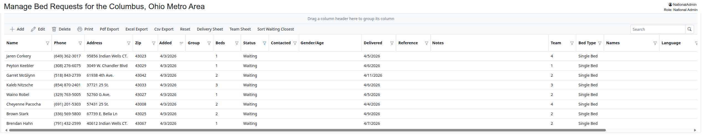
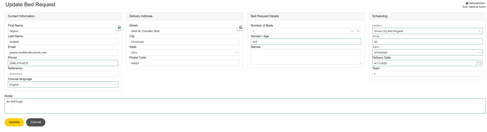

# How To Schedule Bed Requests

Click Login on the Menu

Login using your email and password

Click Bed Requests on the Quick Links or Administration Menu

## The Bed Request Screen
* At any time you may click the *Reset* button to clear any filters and go back to just a filter of *Waiting*
* Double click a row to Edit
* To Filter, click on the filter of a column

## Editing Bed Requests
* To schedule a Bed Request:
    * Change the Location if you are taking this Bed Request from another Location in a Metro Area.  The Group will automatically change.
    * Change the *Group* if needed if this is a bed blitz or not a normal delivery day.
    * Change the *Status* to *Scheduled*
    * Change the *Delivery Date* to the date it will be delivered.
    * Enter the *Team Number*
    * Enter any *Notes* if needed.
    * Click *Update*
    

## Creating the Delivery Sheet
* Change the *Status* filter to *Scheduled*
* Click on a row for the intended *Group* and *Delivery Date*
* Click on the *Delivery Sheet* button